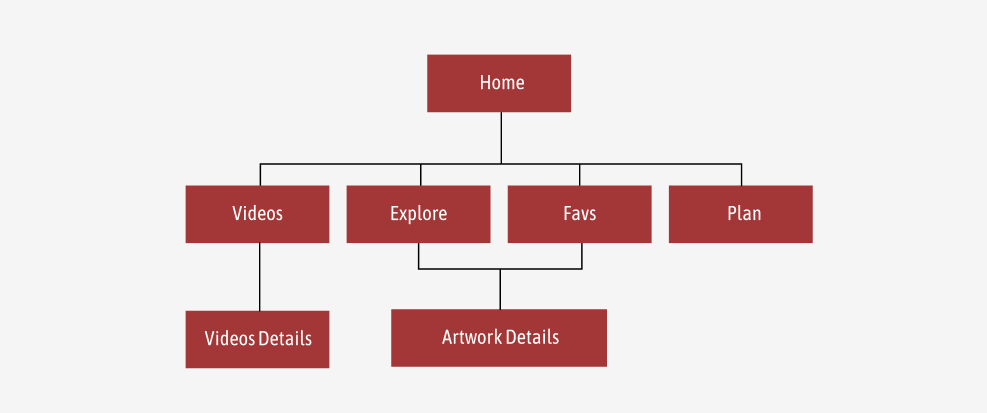

## Virtual Museum

### Description
This project aims to utilise the Cooper-Hewitt API to explore alternative ways for users to experience museum exhibitions remotely.
The API contains details of digitized artworks, exhibition information and details of the museum itself.

### Project Goals
#### MVP
1. Create project components and assemble using React
2. Use of Fetch API to retrieve data
3. Use of React Hooks 
4. Use of Libraries
5. Testing on Vite, deployment on Vercel

#### Additional Goals
1. Implementation of CRUD Operations
2. Exploration of component libraries

#### React Hooks
1. useState
2. useEffect
3. useContext
4. useReducer
5. useRef

#### Chosen Libraries / Additional APIs
1. urlcat - For more concise and accurate URLs
2. MUI - To implement pre-designed components (eg. Accordion/Input Fields)
3. Splide - Display photos as slideshow
4. Geoapify - To generate static map

### Project Structure
#### Routes

#### Components

### Future Developments
1. Experimenting with local storage to avoid losing information when page is closed/refreshed
2. Implementation of user-based system
3. Refining code with better combination of useState and useReducer

### External Credits
Frame CSS - https://codepen.io/chris22smith/pen/PbBwjp